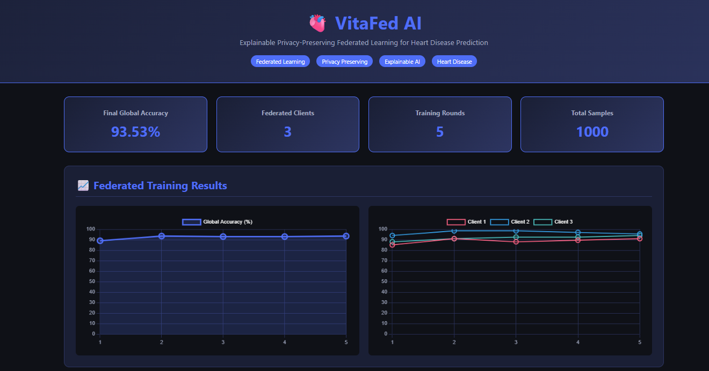
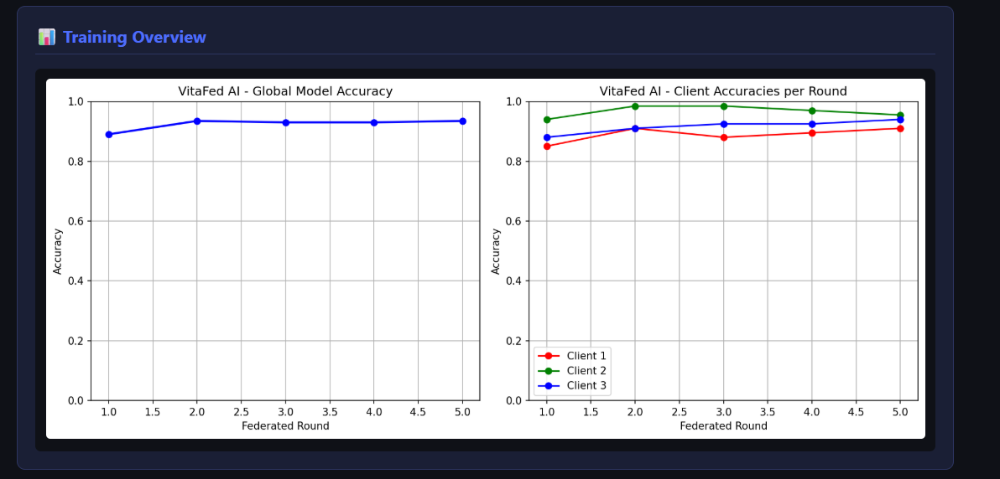
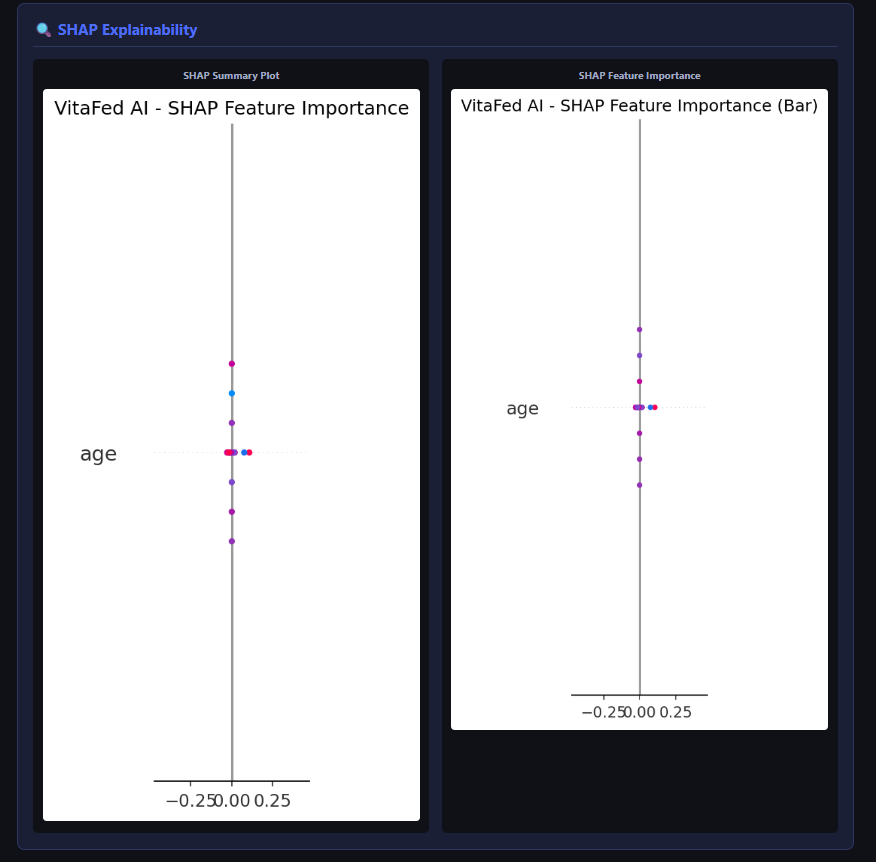
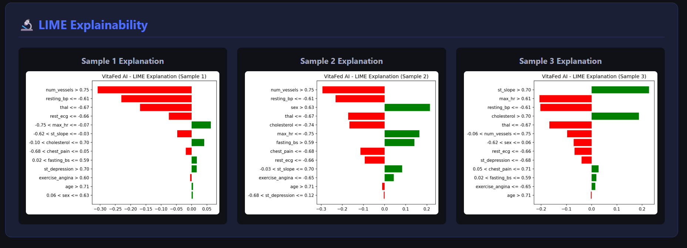

# 🫀 VitaFed AI
🌐 *Live Dashboard:* [https://vitafed-ai.onrender.com](https://vitafed-ai.onrender.com)
> **Explainable Privacy-Preserving Federated Learning Framework for Heart Disease Prediction**


---

## 📌 Overview

**VitaFed AI** is a research project that implements a privacy-preserving federated learning framework for heart disease prediction. The system trains machine learning models across multiple clients without sharing raw patient data, ensuring privacy while maintaining high prediction accuracy. Explainable AI techniques (SHAP and LIME) are integrated to provide transparency in model decisions.

---

## 🖥️ Dashboard Screenshots

### Header & Stats





### Training Charts





### SHAP Explainability





### LIME Explainability





---

## ✨ Features

- **Federated Learning** — Train across 3 clients without sharing raw data
- **Privacy Preserving** — Only model weights are shared, never patient data
- **Explainable AI** — SHAP and LIME explanations for every prediction
- **Heart Disease Prediction** — Neural network trained on heart disease features
- **Interactive Dashboard** — Flask web dashboard with real-time visualizations
- **FedAvg Algorithm** — Weighted aggregation of client models

---

## 📂 Project Structure

```plaintext
VitaFed-AI/
│
├── data/
│   └── heart_data.py              # Data loading and client splitting
│
├── clients/
│   ├── client1.py                 # Federated client 1 training
│   ├── client2.py                 # Federated client 2 training
│   └── client3.py                 # Federated client 3 training
│
├── models/
│   ├── global_model.py            # Neural network architecture
│   └── aggregator.py              # FedAvg aggregation algorithm
│
├── explainability/
│   ├── shap_explain.py            # SHAP explanations
│   └── lime_explain.py            # LIME explanations
│
├── dashboard/
│   ├── app.py                     # Flask dashboard backend
│   └── templates/
│       └── index.html             # Dashboard frontend UI
│
├── results/
│   ├── training_results.json
│   ├── training_results.png
│   ├── shap_summary.png
│   ├── shap_bar.png
│   ├── lime_explanation_1.png
│   ├── lime_explanation_2.png
│   └── lime_explanation_3.png
│
├── screenshots/
│   └── dashboard_screenshot.png
│
├── main.py                        # Main federated training pipeline
│
└── requirements.txt               # Project dependencies
```
---

## 🧠 Model Architecture

- **Type:** Neural Network (PyTorch)
- **Input:** 13 heart disease features
- **Layers:** Linear(13→64) → ReLU → Dropout → Linear(64→32) → ReLU → Dropout → Linear(32→16) → ReLU → Linear(16→1) → Sigmoid
- **Loss:** Binary Cross Entropy
- **Optimizer:** Adam

---

## 🔒 Federated Learning Setup

| Component | Details |
|-----------|---------|
| Algorithm | FedAvg (Federated Averaging) |
| Clients | 3 hospital clients |
| Rounds | 5 federated rounds |
| Epochs per round | 10 local epochs |
| Aggregation | Weighted average by sample size |

---

## 📊 Features Used

| Feature | Description |
|---------|-------------|
| age | Age of patient |
| sex | Gender |
| chest_pain | Chest pain type |
| resting_bp | Resting blood pressure |
| cholesterol | Serum cholesterol |
| fasting_bs | Fasting blood sugar |
| rest_ecg | Resting ECG results |
| max_hr | Maximum heart rate |
| exercise_angina | Exercise induced angina |
| st_depression | ST depression |
| st_slope | Slope of ST segment |
| num_vessels | Number of vessels |
| thal | Thalassemia |

---

## 🔍 Explainability

### SHAP (SHapley Additive exPlanations)
- Global feature importance
- Shows which features most influence predictions
- Summary plot and bar plot generated

### LIME (Local Interpretable Model-agnostic Explanations)
- Local explanation for individual predictions
- Explains why a specific patient is predicted as high/low risk

---

## 🛠️ Technologies Used

- **Python 3.8+**
- **PyTorch** — Neural network training
- **Flask** — Web dashboard
- **SHAP** — Explainability
- **LIME** — Local explanations
- **Scikit-learn** — Data preprocessing
- **Matplotlib & Seaborn** — Visualizations
- **NumPy & Pandas** — Data handling

---

## 🚀 How to Run

**Step 1 — Clone Repository**
```bash
git clone https://github.com/yourusername/VitaFed-AI.git
Step 2 — Navigate to Project Folder
cd VitaFed-AI
Step 3 — Create Virtual Environment
python -m venv venv
Step 4 — Activate Environment (Windows)
venv\Scripts\activate
Step 5 — Install Requirements
pip install -r requirements.txt
Step 6 — Run Training Pipeline
python main.py
Step 7 — Run Dashboard
python -m dashboard.app
Step 8 — Open Browser
http://127.0.0.1:5000
📈 Results
Federated Rounds: 5
Number of Clients: 3
Total Training Samples: 800
Total Test Samples: 201
Explainability: SHAP + LIME
🔮 Future Improvements
Differential Privacy integration
More hospital clients
Real hospital dataset integration
Cloud deployment
User authentication
Real-time patient data input
Deep Learning improvements
📝 Research Paper
This project is implemented as part of a research paper on:
"Explainable Privacy-Preserving Federated Learning Framework for Heart Disease Prediction"
👨‍💻 Author
Swarnali Ghosh
GitHub: @swarnali2005
📄 License
This project is licensed under the MIT License.
VitaFed AI — Federated Learning for a Healthier Future 🫀